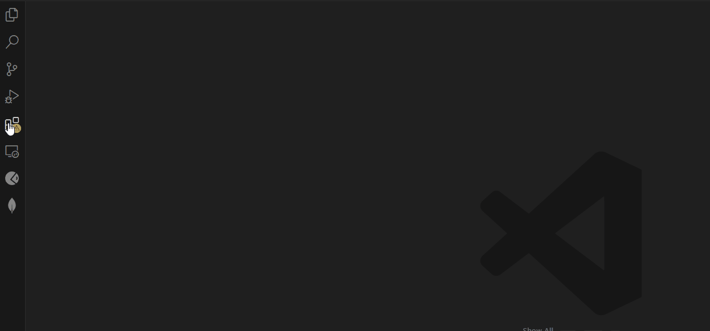

<p align="center"> </p>

# A11y Root: VS Code Extension

**“A Visual Studio Code extension rooted in accessibility”**

Developed through **OSLabs**, a nonprofit tech accelerator, **[A11y Root](https://a11yroot.dev)** is a **VS Code Extension** paired with a **Companion Web Dashboard**. It streamlines accessibility analysis and fosters collaboration across development teams by exposing accessibility insights and enabling seamless communication between developers, designers, and stakeholders.

---

## Overview

A11y Root integrates **WCAG compliance** tools directly into the development workflow. The extension provides:

- **Accessibility Tree Visualization**: Exposes the full accessibility tree, allowing developers to understand how assistive technologies interact with the DOM.
- **Real-Time Analysis**: Detects WCAG guideline issues in projects and provides actionable insights.
- **Team Collaboration**: Enables sharing of accessibility reports through public links for seamless collaboration.
- **Simplified Development Workflow**: Makes accessibility a priority from day one.

---

## Requirements

- A11y Root is currently compatible with Windows and MacOS installations of Visual Studio Code.
- You may need to install Puppeteer to have a instance of Chromium, since the extension uses this as a headless browser.

# Installing Puppeteer

Puppeteer is a Node library that provides a high-level API to control headless Chrome or Chromium browsers. Here’s how you can install it in your project:

# Installation

To install Puppeteer, use npm:

```bash
npm install puppeteer
```

# For Mac users

We do have a version of the extension that includes its own instance of Chromium.
We hope to have similar options for Windows and Linux users in the near future.

[A11y Root - Chromium Bundle](a11y-root-extension-mac-1.0.0-beta.vsix)

- Unfortunately at this time, our extension encounters critical issues when attempting to use in a Linux environment (including WSL/Ubuntu)

  - As a temporary workaround for WSL, users can manually install certain dependencies in their environment.

  > sudo apt install libgtk-3-dev libnotify-dev libgconf-2-4 libnss3 libxss1 libasound2

Resolving these OS / dependency issues are a high priority for our development team! We hope to have an environment agnostic version of the extension available soon!

---

## Features

### **VS Code Extension**

- Built with **React** and the **VS Code API**, the extension integrates accessibility analysis directly into the IDE.
- Key functionalities include:
  - Visualizing **header hierarchies**, **tabindex**, and **skip links**.
  - Mapping the **entire accessibility tree** for web page architectures.
  - Identifying and reporting **non-compliant elements**.

### **Puppeteer Integration**

- Utilized Puppeteer for:
  - Generating accessibility trees.
  - Performing **headless browser navigation** to analyze DOM structures.
- Chose Puppeteer over Playwright for its ability to produce a **physical accessibility tree**, critical for visualization.

### **Companion Web Dashboard**

- Built with **React**, the dashboard:
  - Displays accessibility tree visualizations for projects.
  - Allows toggling of non-compliant UI components.
  - Provides **shareable public links** for cross-team collaboration.

### **Collaborative Features**

- Enables sharing of page-specific accessibility data.
- Bridges communication gaps between developers, designers, and stakeholders.

---

## Get Started

1. Download the A11y Root Extension File (.vsix) from [our website](https://a11yroot.dev/).

2. [Install the extension](https://code.visualstudio.com/docs/editor/extension-marketplace#_install-from-a-vsix) in VS Code.

<p align="center"> </p>

3. Enter

   > \>A11y Root

   into your VS Code search bar to open the extension.

<p align="center"> </p>

4. Log in through GitHub OAuth. This login is a one-time requirement; subsequent uses of the extension will persist your user details. Logging in with GitHub allows us to easily associate your projects and their page accessibility trees with you in our database, allowing them to be retrieved and shared later.

5. Spin up your project in your dev environment. Once it is running, enter the applicable URL into A11y Root extension and click "check page".

<p align="center"> </p>

6. Additional pages of the same application can also be checked. Either by entering the full URL, or by adding the page to the _Generate URL_ section of the extension.

<p align="center"> </p>

7. Once you get the hang of the extension, head over to our [developer dashboard](https://a11yroot.dev) on our website. From the dashboard, you can see previously generated trees from your various projects. Pages generated from the same project will be grouped together. Each tree can also be shared via direct link. You can send this link to co-contributors and project stakeholders to collaborate on necessary accessibility changes.

8. Start building with accessibility in mind!

---

## Known Issues / Limitations

The extension currently experiences issues parsing HTTPS URLs of local dev environments (for example: https://localhost:8080/).

To analyze pages that have an async fetch of resources, the extension may occasionally parse before that content is loaded properly. In most cases, checking the same page a subsequent time will work (and the saved results will overwrite the previously generated results).

---

## Tech Stack

- **VS Code Extension API**
- **TypeScript**
- **React** / **React Router**
- **Express**
- **Puppeteer**
- **GitHub OAuth**
- **MongoDB / Mongoose**

---

## Key Decisions

### Puppeteer Over Playwright

- **Why Puppeteer?**:
  - Puppeteer’s `accessibility.snapshot()` provides full accessibility trees for visualization.
  - Playwright's newer `ariaSnapshot()` focuses on individual elements, limiting comprehensive tree generation.
- **Fun Fact**: Playwright, though created by the same team, supports more browsers (Chromium, WebKit, Firefox), but Puppeteer’s focus on Chromium was better suited for our needs.

### MongoDB Over SQL

- MongoDB was chosen for its ability to handle **highly nested accessibility trees** and provide a flexible schema.
- JSON-based storage simplified retrieval and accelerated development, making it ideal for this project.

---

## Authentication

- **GitHub OAuth x 2**:
  - Streamlined developer login for both the VS Code extension and the companion web app.
  - **Why GitHub OAuth?**:
    - Easy setup compared to Google OAuth.
    - Tailored for developers, aligning with their existing GitHub accounts.

---

## Impact

By integrating the VS Code extension with a **centralized database** and **companion web dashboard**, **A11y Root** creates a robust ecosystem for accessibility analysis.

- Developers benefit from actionable insights directly within their workflow.
- Project stakeholders gain a centralized, shareable resource to address accessibility issues collaboratively.

**“Planting accessibility (a11y) into the development workflow from day one.”**

---

## License

This project is licensed under the Apache License, Version 2.0. See the [LICENSE](./LICENSE) file for details.

---

## Contributing

We welcome contributions from the community! Check out our [CONTRIBUTING.md](./CONTRIBUTING.md) for guidelines on how to get involved.

---

## Key Contributors

This product was initially created and deployed by the following team of developers.

<table>
<td align="center">
  
  <br/>
  <sub><b>Tamika Blakey</b></sub>
  <br/>
  <a href="https://github.com/jamagachi">GitHub</a>
  <a href="https://www.linkedin.com/in/tamikablakey/">LinkedIn</a>
</td>

<td align="center">
  
  <br/>
  <sub><b>Ian Buchanan</b></sub>
  <br/>
  <a href="https://github.com/ianbuchanan42">GitHub</a>
  <a href="https://www.linkedin.com/in/ian-buchanan-accessibility/">LinkedIn</a>
</td>

<td align="center">
  
  <br/>
  <sub><b>Claire Chen</b></sub>
  <br/>
  <a href="https://github.com/claireandj666">GitHub</a>
  <a href="https://www.linkedin.com/in/claire-chen11/">LinkedIn</a>
</td>

<td align="center">
  
  <br/>
  <sub><b>Warren Cutler</b></sub>
  <br/>
  <a href="https://github.com/warren-cutler">GitHub</a>
  <a href="https://www.linkedin.com/in/warren-cutler/">LinkedIn</a>
</td>

<td align="center">
  
  <br/>
  <sub><b>Jeet Patel</b></sub>
  <br/>
  <a href="https://github.com/Jeetp45">GitHub</a>
  <a href="https://www.linkedin.com/in/jeetpatel-a83820254/">LinkedIn</a>
</td>

</table>

---

## Acknowledgments

- **OSLabs**: For supporting this project through their nonprofit tech accelerator program.
- **Puppeteer Team**: For their robust accessibility tools and support.
